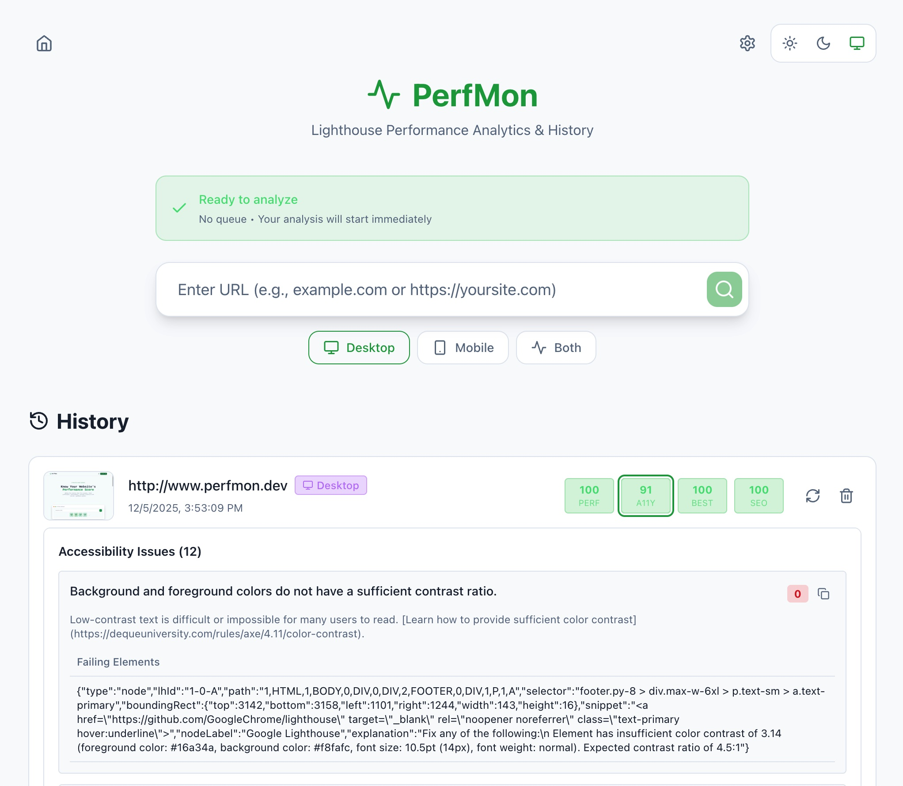

# PerfMon

Vibe coding makes software engineering faster — just make sure all your apps stay in tip-top shape



## Features

- **Lighthouse Integration**: Runs full Lighthouse analysis on any URL.
- **History Tracking**: Saves all analysis reports locally using IndexedDB.
- **Desktop App**: Optional Tauri desktop app for macOS, Windows, and Linux.
- **Perfect Score Architecture**: Built with performance and accessibility in mind.
- **Modern UI**: Clean, dark-mode interface using Tailwind CSS.

## Setup

### Local Development

1. Install dependencies:

   ```bash
   npm install
   ```

2. Start the app (runs both server and client):

   ```bash
   npm run dev
   ```

3. Open http://localhost:5173 in your browser.

### Production Deployment (Docker)

Deploy to a server with Docker installed:

```bash
./deploy.sh
```

This deploys to a DigitalOcean droplet with:
- 5 Lighthouse worker containers (scalable)
- Queue manager for job distribution
- Nginx load balancer

#### Scaling Workers

Change the number of workers in `docker-compose.yml`:

```yaml
deploy:
  replicas: 10  # Change this number
```

Or scale at runtime:

```bash
docker compose up -d --scale worker=10
```

### Docker Compose Commands

```bash
# View all logs
docker compose logs -f

# View specific service logs
docker compose logs -f worker
docker compose logs -f queue-manager
docker compose logs -f nginx-lb

# Stop services
docker compose down

# Rebuild and restart
docker compose up --build -d

# Check service status
docker compose ps

# Check queue stats
curl http://localhost:9001/api/queue-stats
```

## Usage

1. Enter a URL (e.g., `example.com` or `https://example.com`) in the search box.
2. Click the search button to start analysis.
3. View the results and history below.

## Architecture

### Docker Compose Services

- **nginx-lb**: Load balancer routing requests to queue manager
  - Port 9001 (HTTP)
- **queue-manager**: Distributes jobs to available workers
  - Auto-discovers workers via Docker DNS
  - Provides `/api/queue-stats` endpoint
- **worker**: Lighthouse analysis workers (scalable)
  - Each runs Chrome headless for Lighthouse
  - Default: 5 replicas

### Project Structure

```
perfmon/
├── server/           # Lighthouse server (runs locally and in Docker)
├── queue-manager/    # Job queue and worker coordination
├── src/              # Frontend React app
├── Dockerfile        # Worker container image
├── Dockerfile.queue  # Queue manager container image
├── docker-compose.yml
├── nginx-lb.conf     # Load balancer config
└── deploy.sh         # Production deployment script
```

## Desktop App

Build the Tauri desktop app:

```bash
npm run tauri:build
```

Output: `src-tauri/target/release/bundle/`

## Connect

If you found this tool useful, feel free to connect:

- [LinkedIn](https://www.linkedin.com/in/david-ang-0932bb4a/)
- [X/Twitter](https://x.com/papayaahtries)
- [Reddit](https://www.reddit.com/user/Prize-Coyote-6989/)
- [Devpost](https://devpost.com/software/perfmon)
